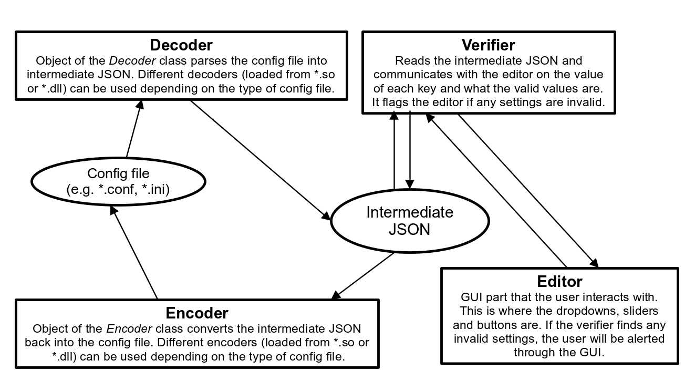

# Fidgety

A graphical app that edits config files using toggles, dropdowns, sliders and text entry fields.

This app got its name from those fidget toys with buttons and joysticks.

# Schematic



# Platform Availability

This project was created to address the UI problem in Linux where users are
usually expected to configure their system by editing config files instead of
through a simple GUI as seen on a Windows or MacOS system. Therefore, this
app will have first-class support on Linux and will be developed according to
this policy. You can try and contribute by porting this project to other
operating systems (especially on Windows, where CMake's documentation really
failed me with the find_package part). Due to differences between the versions
of various dependencies in different distributions, Fidgety may fail to compile.
Currently, Fidgety compiles *without warnings* on Arch Linux but I have yet to
test it on Debian.

# Building

Fidgety requires that you have [CMake](https://cmake.org) (>= 3.14) installed
as it is the build system used by this project. CMake version 3.14 and above
provides important functionality that this project relies on.

You also need a working copy of git to download
[googletest](https://github.com/google/googletest)
from [Github](https://github.com).

You will also need to install Qt6, spdlog and nlohmann_json with
the corresponding *.cmake files in your system directories. This allows CMake
to search and load these packages through the `find_package` function.
Your distribution's package manager should be able to handle the installation
of these libraries for you without much trouble.

Preferably, you should have a recent version of Make installed so that you can
run the various common tasks (targets) in /Makefile.

The table below shows the targets defined in the Makefile and what they do.

| Target | Function |
| ------ | -------- |
| generate | Generate the build directory that CMake stores its cache in. This is also the step where dependencies are searched for and googletest is downloaded (unless specified otherwise). |
| build | Compile Fidgety and the test suite (can be opted out). |
| test | Run the test suites written for Fidgety. This will fail if the tests aren't built. |
| install | Install to the dist/ prefix. The folder can be changed by adding `DIST_DIR=<directory>` to the end of the make command. |

## Supplementary Build Flags

The Makefile in the root of the project directory allows you to add
supplementary flags to configure what gets built and therefore what components
of Fidgety gets installed. You can set these supplementary flags by setting
environment variables containing a space-separated list of command line
arguments (that must be readable by CMake, CTest or CPack, depending on the
command). The contents of these environment variables are expanded at the end
of the relevant commands in the Makefile. For example, the
`CMAKE_GENERATE_SUPPFLAGS`, which contains the command line arguments for
generating the `build/` directory by CMake, is used by the Make target called
`generate`. This target calls CMake using a command that looks like so:

```shell
$(CMAKE) -B $(BUILD_DIR) -S $(SRC_DIR) $(CMAKE_GENERATE_SUPPFLAGS)
```

If `CMAKE_GENERATE_SUPPFLAGS` is defined as `-DBUILD_TESTING=OFF`, then this
command would be expanded as such:

```shell
cmake -B build/ -S . -DBUILD_TESTING=OFF
```

Other environment variables for supplementary flags exist for the other targets
in the Makefile (as specified in the table in [Building](#building)). The table
below shows what each environment variable is used for.

| Environment Variable | Function |
| -------------------- | -------- |
| CMAKE_GENERATE_SUPPFLAGS | The arguments used to generate the build the directory used by CMake. |
| CMAKE_BUILD_SUPPFLAGS | The arguments used when CMake is called to compile the various targets in Fidgety. |
| CMAKE_TEST_SUPPFLAGS | The arguments used when calling `ctest`. |
| CMAKE_INSTALL_SUPPFLAGS | The arguments used when installing (to the install prefix) the artifacts generated when building the targets in Fidgety by CMake. |

### Directory Flags

In addition, you can change the value of the variables which tell CMake where
the build directory should be generated, where build artifacts should be
installed to and even where the source files are located. Just like the
supplementary flags in [Supplementary Build Flags](#supplementary-build-flags),
you can override the default values of these variables by setting environment
variables.

| Makefile Variable (Environment Variable) | Default Value | Function |
| ---------------------------------------- | ------------- | -------- |
| DIST_DIR | dist/ | The install prefix used by the `install` target. |
| BUILD_DIR | build/ | The build directory generated by CMake. |
| SRC_DIR | ./ | The root of the project source. |

### Opting out of building tests

If you do not want to conduct tests (and not have googletest pollute the dist/)
directory, you can add the following environment variable to the `make` command.

```
CMAKE_GENERATE_SUPPFLAGS=-DBUILD_TESTING=OFF
```

For example, to build Fidgety without tests, you can enter:

```shell
make -j8 build CMAKE_GENERATE_SUPPFLAGS=-DBUILD_TESTING=OFF
```
